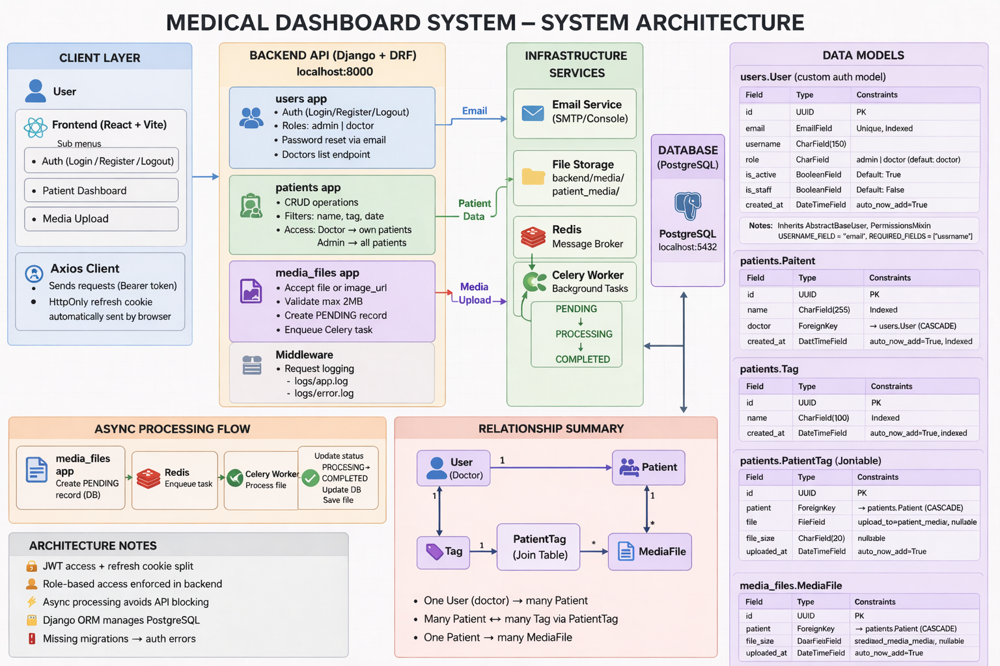
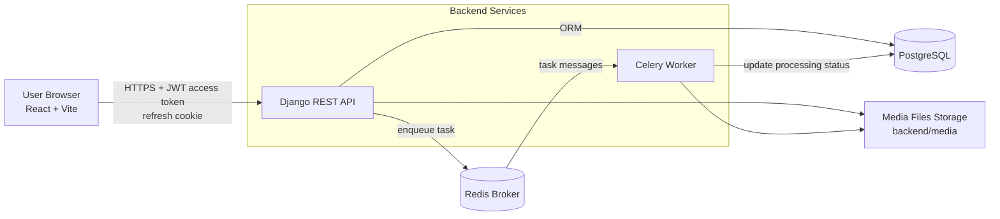

# System Design - MedDash

This file documents the architecture used in this assignment.

## Architecture Image

## 1) High-Level Architecture Diagram

## 2) Component Responsibilities

- React frontend
  - Handles login/logout, patient listing/filtering, patient details, and media upload.
  - Stores short-lived access token in local storage.
  - Sends refresh requests with HttpOnly refresh cookie.

- Django REST API
  - Auth endpoints, role-based permissions, patient CRUD, and media endpoints.
  - Uses PostgreSQL for persistent domain data.
  - Emits background jobs for media processing through Celery.

- Celery worker
  - Consumes tasks from Redis.
  - Processes uploaded media asynchronously.
  - Writes job results/status back to PostgreSQL.

- PostgreSQL
  - Source of truth for users, patients, tags, media metadata, and processing status.

- Redis
  - Message broker for Celery jobs.

- File storage (`backend/media`)
  - Stores uploaded patient files.

## 3) Core Runtime Flows

### A. Authentication Flow
1. User logs in from React.
2. Django validates credentials.
3. Django returns access token and sets refresh token cookie.
4. React includes access token in `Authorization: Bearer ...` for API calls.
5. On access token expiry, frontend calls refresh endpoint and retries original request.

### B. Media Upload Flow
1. User uploads file for a patient from UI.
2. Django stores initial media record and file.
3. Django enqueues Celery task in Redis.
4. Celery processes file in background.
5. Worker updates media status in database.
6. UI reads updated status via API.

## 4) Security and Access Control

- Role-based access:
  - `admin`: full patient visibility and doctor assignment.
  - `doctor`: limited to assigned patients.
- Refresh token uses HttpOnly cookie to reduce XSS exposure.
- CORS/CSRF trusted origins are configured for local frontend hosts.

## 5) Deployment Topology (as submitted)

- Docker Compose services:
  - `backend` (Django API)
  - `db` (PostgreSQL)
  - `redis` (Redis broker)
  - `worker` (Celery)
- Frontend is run separately via Vite dev server in this assignment.

## 6) Known Boundaries

- Current setup is optimized for local development and assignment evaluation.
